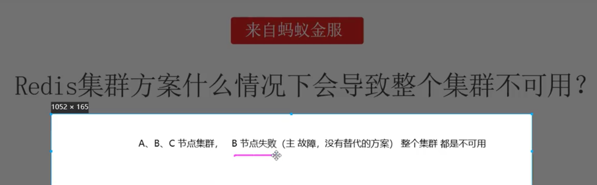
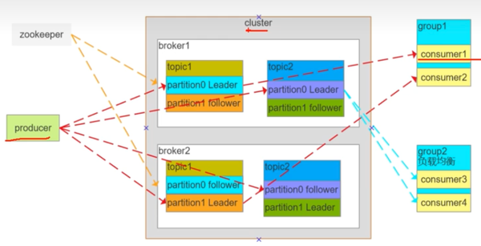
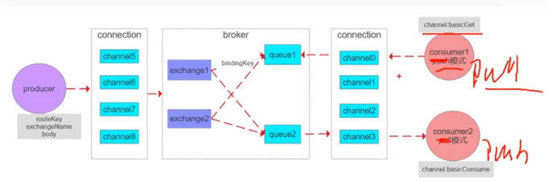
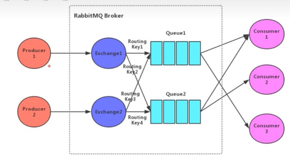
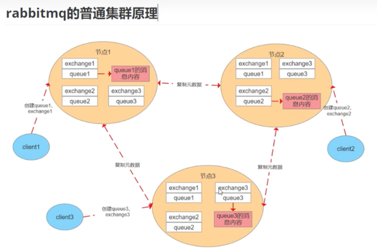
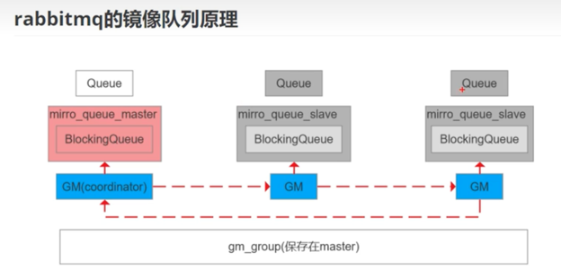
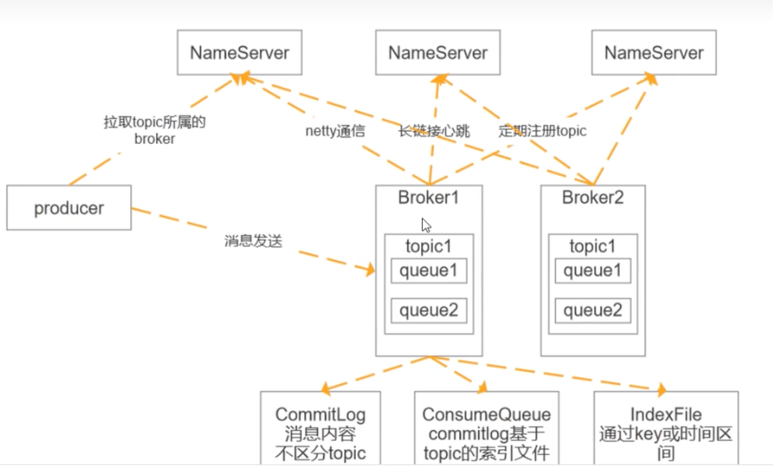

## 二叉树的面试题
* 二叉搜索树和平衡二叉树有什么关系？

## Redis面试题
* Redis的集群方案该怎么做；马士兵21
* Redis集群方案什么情况下会导致集群不可用？马士兵22
  


# 常用MQ

## MQ常见问题
### 消息队列如何保证消息可靠传输
可靠表示不能多也不能少
* 保证消息不多发且不重复，即生产者不能重复生产，且消费者不能重复消费；
  * 消息不多发：难控制，由生产者控制；
  * 避免重复消费：最保险的是实现消费者的幂等性，即就算重复消费，也不会有问题；
* 消息不能少：即消息不能丢失；生产的消息一定要被消费到
  * 生产者发送消息，要确认broker收到并持久化：入RabbitMQ的Confirm，Kafka的ACK机制；
  * Broker要等消费者真正消费后才能删除消息，即消费端的ACK机制；

### 消息队列的作用
* 解耦：系统之间不用相互依赖，降低系统的耦合性；
* 异步：生产者只需要发送消息到MQ中，无需同步等待消息被消费；
* 削峰：生产者生产速度过快时，消息放到MQ中，由消费者控制消费速度；

### 如何保证MQ消息不被重复消费
消费端ACK能够降低消息被重复消费的概率，但是无法完全避免，完全避免需要保证系统的幂等性：即一个数据或请求，重复来多次，确保对应的数据不会改变；以下是实现思路：
* 使用Redis：每次set，天然幂等性；
* 消息带上全局唯一ID；
* 基于数据库的唯一键；

### 死信队列是什么，延时队列是什么？
[//]: # (TODO 延时队列是怎么实现的？)
* 死信队列：也是一个消息队列，存放的是多次重试仍未被成功消费的消息；主要用来做消息重试；
* 延时队列：存放需要在指定时间被处理的消息；通常可以用来做一些有过期性质的业务：如十分钟未支付则取消订单；

### 消息队列的优缺点以及使用场景
* 优点
  * 解耦：降低系统之间的耦合性和依赖(熔断、服务降级基本不会发生-俩系统之间)；
  * 异步：不用同步等待消息消费，消费能力跟不上，可启动多个消费端；
  * 削峰填谷：生产速度很快时，防止系统崩溃，消费速度由消费端控制；
* 缺点
  * 引入第三方组件，增加了系统的复杂度（幂等，重复消费和消息丢失等问题）
  * 系统可用性降低，MQ的故障会影响系统的可用；
  * 一致性：消费端可能会消费失败；
* 使用场景
  * 日志收集
  * 发布订阅

### Kafka、ActiveMQ、RabbitMQ、RocketMQ对比
考察候选人知识面
* ActiveMQ(万级吞吐)：JMS规范(JavaEE)、支持事务、支持XA协议，没有生产大规模支撑场景，官方维护越来越少
* RabbitMQ(万级吞吐)：erlang语言开发、性能好、并发高，支持多种语言，社区文档方面有优势；erlang语言不利于Java程序员的二次开发，依赖开源社区的维护和升级，需要学习AMQP协议，学习成本相对较高
* Kafka(百万级吞吐)：高性能高可用，生产环境有大规模适应场景，单机容量有限(超过64个分区响应明显变长)，社区更新慢。
* RocketMQ(十万级吞吐)：Java实现，方便二次开发，设计参考了Kafka，高可用、高可靠(零丢失，Kafka做不到零丢失)，社区活跃度一般，支持语言较少

* 综上，ActiveMQ在生产中没有经过考验，用的比较少；RabbitMQ小公司使用广泛；RocketMQ主要用于银行金融领域(消息零丢失且性能较高)；Kafka应用则会更广泛一些，大数据领域最常用。

## Kafka
### 什么是Kafka的Rebalance机制？
[//]: # (TODO 熟悉了再来解决)

### 简述kafka的副本同步机制

[//]: # (TODO 后续学了再来补)

### 简述Kafka的架构设计
架构图

* 消费者组(Consumer Group)
  组内每个消费者负责消费不同分区的数据，提高消费能力。逻辑上是一个订阅者
* 主题(Topic)
  可以理解为一个队列，Topic将消息分类，生产者和消费者面向的是同一个Topic
* 分区(Partition):
  为了实现扩展性，提高并发能力，一个Topic以多个Partition的方式分不到多个Broker上，每个Partition是一个有序的队列。
  一个Topic的每个Partition都有若干个副本(Replica-可配置)，一个Leader和若干个Follower。生产者是发送数据对象，消费者是消费数据的对象，都是Leader。
  Follower负责实时从Leader中同步数据，保持Leader数据的同步。Leader发生故障时，某个Follower会成为新的Leader(Zookeeper负责)。

### Kafka中Zookeeper的作用
zk在新版本中不断被弱化，最新版本的zk已经被移除了。这道面试题主要问原来的架构作用。
* /brokers/ids: 临时节点，保存所有Broker节点信息，存储Broker的物理地址、版本信息、启动时间等，节点名称为brokerID，Broker定时发送心跳到zk，如果断开则该brokerID会被删除；
* /brokers/topics: 临时节点，节点保存broker节点下所有Topic信息，每个Topic节点下包含一个固定的Partitions节点，partitions的子节点就是Topic的分区，每个分区下保存一个state节点，
  保存当前Leader分区和ISR的brokerID，state节点由Leader创建，若Leader宕机该节点会被删除，直到有新的Leader选举产生，重新生成state节点；
* ISR：可靠的从节点，和主节点保持一致的节点，可能不是全量的。
* /comsumers/[group_id]/owners/[topic]/[topic_id-partition_id]: 维护消费者和分区的注册关系
* /comsumers/[group_id]/offset/[topic]/[topic_id-partition_id]: 分区消息的消费进度Offset
* client通过Topic找到Topic树下的state节点，获取Leader的brokerID，到broker树中找到broker的物理地址，但是client不会直连zk，而是通过配置的broker获取到zk中的信息。

### Kafka高性能的原因
本地考察的是为什么Kafka读写高性能，主要从顺序写和零拷贝着手。

* Kafka不基于内存，而是硬盘存储，因此消息堆积能力更强，那么他是如何解决磁盘速度的呢？
* 顺序写：磁盘的随机访问很慢，但是顺序访问速度就会快很多，SSD的顺序访问甚至可以接近内存；其次Kafka的消息都是append操作，Parittion是有序的，节省了磁盘的寻道时间；
  同时通过批量操作，节省写入次数；Partition物理上分为多个segment存储(类比一个一个文件)，方便删除。
* 传统数据复制
  * 读取磁盘文件数据到内核缓冲区
  * 将内核缓冲区数据Copy到用户缓存区
  * 将用户缓冲区数据Copy到socket的发送缓冲区
  * 将socket发送缓冲区的数据发送到网卡进行传输
* 零拷贝
  * 直接将内核缓冲区的数据发送到网卡传输
  * 使用的是操作系统的指令支持
* Kafka不太依赖JVM(64位机器上JVM的堆栈内存最大32G)，主要用到的是操作系统的pageCache(即Kafka把数据写到页缓存，具体多久刷到硬盘，由操作系统来决定)；
  如果产生消费速率相当，则直接用pageCache交换数据。不需要经过磁盘IO。

### Kafka高性能高吞吐原因
* 磁盘顺序读写：保证消息的堆积能力
  * 顺序读写：磁盘会预读，预读即在起始地址连续读取多个页面，主要时间花费在了传输时间(传输时间对于随机还是顺序来说都是一样的)
  * 随机读写：因为数据没在一起，预读会失效。而磁盘多次寻道和旋转延迟，这个时间可能是传输时间的多倍。
* 零拷贝：避免CPU将数据从一块内存拷贝到另一块内存的技术(数据量较大时，拷贝耗时还是很高)
  * 传统数据复制(见上一节介绍)
  * 零拷贝：磁盘文件->内核空间读取缓冲区->网卡接口->消费者进程(节约内核线程切换，数据多次拷贝)
* 分区分段+索引
  * Kafka的message消息实际上是分布式存储在一个一个小的segment中的，每次文件操作也是直接操作segment。为了进一步的查询优化，Kafka又默认为分段后的数据文件建立了索引文件，就是文件系统上的.index文件。
    这种分区分段+索引的设计，不仅能提升数据读写效率，而且也能提高数据操作的并行度(一个一个segment，类似与hashmap的分段锁，一个文件不影响另一个文件的读写)。
* 批量压缩：多条消息一起压缩，降低带宽
* 批量读写：降低带宽和网络IO
* 存消息直接操作pageCache，而不是JVM，避免GC耗时及对象创建耗时，且读写速度更高，进程重启缓存也不会丢失。

### Kafka消息高可靠解决方案
* 消息发送可靠
  * ack机制：0(不重试，即发送之后不管成功失败) 1(Leader写入成功就返回，但可能写完Leader没同步就宕机，数据会丢失) all/-1(等待ISR同步完成再返回，可靠)
  * unclean.leader.election.enable: false 禁止选举ISR以外的follower为Leader。ISR(和Leader状态同步的)，OSR(和Leader状态不同步的)，ISR和OSR可动态转换，状态一直则可以加入ISR。
  * tries > 1: 重试次数
  * min.insync.replicas > 1: 最小同步副本数，没满足该值前，不提供读写服务，写操作会异常
* 消费可靠
  * 手工提交offset
  * broker：减小刷盘间隔(调用Fsync，减小掉电没来及刷盘的风险)
  * 事务消息

### Kafka为什么比RocketMQ的吞吐量高？
* Kafka生产者采用的是异步发送消息机制，当发送一条消息时，消息可能没有立刻发送到Broker而是缓存起来，然后直接向业务返回成功，当缓存的消息达到一定量级再批量发送到Broker。
  这种做法减少了网络IO，从而提高了消息发送的吞吐量，但如果消息生产者宕机，会导致消息丢失，业务出错，所以理论上Kafka利用此机制提高了性能，代价是降低了可靠性。
* RocketMQ的底层实现原理
RocketMQ由NameServer集群、Producer集群、Consumer集群、Broker集群组成，消息生产和消费的大致原理如下：
  * Broker在启动的时候向所有的NameServer注册，并保持长连接，每30s发送一次心跳；
  * producer在发送消息的时候从NameServer获取Broker服务器地址，根据LB算法选择一台服务器来发送消息；
  * Consumer消费消息的时候同样从NameServer获取Broker地址，然后主动拉取消息来消费；

### Kafka消息丢失的场景及解决方案
* 生产端
  * ack=0： 不重试，producer发送完消息，不管结果直接返回，如果发送失败，数据会丢失；
  * ack=1： Leader crash，producer发送完消息，只等Leader写入成功就返回，follower如果没来得及同步Leader就宕机，此时也会丢失消息；
  * unclean.leader.election.enable=true: 表示允许选举ISR以外的副本节点作为Leader，OSR的节点和Leader状态不一致，如果当选Leader后，消息可能也会丢失；
* 生产端解决
  * 配置ack=all/-1, tries > 1, unclean.leader.election.enable: false =》表示Leader要等待follower节点同步成功后才允许返回，并且不允许选举OSR的节点作为Leader；
  * 配置：min.insync.replicas > 1: 表示确认写操作成功的最小副本数量，如果不满足这个最小值，生产者会引发一个异常(NotEnoughReplicas、NotEnoughReplicasAfterAppend);
    min.insync.replicas和ack的值提供了持久性保证，确保大多数副本没有收到写操作，则生产者会引发异常
  * 失败的offset单独记录：producer发送消息会自动重试，遇到不可恢复异常会抛出，这时捕获异常记录到数据库或缓存中，做单独处理
* 消费端
  * 假设先commit再处理消息，但是如果在处理消息的时候异常了，offset已经在commit时提交了，对于消费者来说就是消息丢失，再也不会消费到数据了；
  * 那假设先处理再commit呢：消息不会丢失，但可能会存在重复消费。即消息处理完成，在commit之前消费端宕机，消息无法确认，此时重启后，就可能存在重复消费的情况。==> **保证接口的幂等性，即同一条消息不被重复消费**
* Broker刷盘：Broker把消息缓存到pageCache中的，如果没来得及刷到磁盘中，这一部分消息可能丢失
  * 解决方案：减少刷盘间隔

### Kafka是pull还是push呢？请分析一下优劣
* pull模式(主动拉)
  * 根据cConsumer消费能力进行数据拉取，消费者控制速率
  * 可以批量拉取，也可以单条拉取
  * 可以设置不同的提交方式，实现不同的传输语义(至少一次，至多一次，精准一次)
  * 缺点：如果Kafka中没有消息，会导致Consumer空循环，消耗资源；pull时效性不一定很高(消息积压可能导致滞后)
  * 解决：通过参数设置，Consumer拉取数据为空或者没有达到一定数量时进行阻塞；
* push模式(被动接收)
  * 不会导致Consumer循环等待
  * 缺点：速率固定，忽略Consumer的消费能力，可能会导致消费端拒绝服务或者网络拥塞等待

## RabbitMQ
### 简述RabbitMQ的架构设计
基于AMQP协议实现


* Broker：RabbitMQ的服务节点
* Vhost：虚拟主机，Broker表示物理主机，在Broker上可以创建多个vhost。每一个vhost也有完整的Exchange和Queue，这样好处是可以做到隔离。不至于让Exchange过于复杂
* Queue：队列，RabbitMQ内部对象，用于存储消息。RabbitMQ中消息只能存储在队列中；生产者将消息投递到队列中，消费者从队列中拉取消息并消费；多个消费者可以订阅同一个队列，
  这时队列中的消息会被平均分摊(轮询)给多个消费者进行消费。(注：RabbitMQ不支持队列层面的广播消费，如果需要广播消费，可采用一个交换器通过路由Key绑定多个队列，多个消费者来订阅这些队列)
* Exchange：交换器。生产者将消息发送到Exchange，由交换器将消息路由到一个或多个队列中。如果路由不到，或返回给生产者，或直接丢弃，或做其他处理。
  * 扇形交换器：多对多，不需要指定RoutingKey，直接将消息投递到所有队列中。
  * Direct交换器：RoutingKey和BindingKey一对一匹配
  * Topic交换器：RoutingKey和对应的BindingKey一对多，可以使用通配符来匹配(ab*)
  * header交换器：用的少
* RoutingKey：路由Key。生产者将消息发送给交换器的时候，一般会指定一个RoutingKey，用来指定这个消息的路由规则。这个路由Key需要与交换器类型和绑定键(BindingKey)联合使用才最终生效。
  在交换器类型和绑定键固定的情况下，生产者可以在发送消息给交换器时通过指定RoutingKey来决定消息流向哪里。
* BindingKey：绑定key，通过绑定将交换器和队列关联起来，在绑定的时候一般会指定一个绑定键，这样RabbitMQ就可以通过绑定键正确的找到路由队列。
  交换器和队列时多对多的关系，类比于数据库中的两张表，通过BindingKey(外键)做关联。在投递消息时，可以通过Exchange和RoutingKey(对应BindingKey)就可以找到对应队列。
* 信道：信道是建立在Connection之上的虚拟连接。当应用程序与Rabbit Broker简历TCP连接之后，客户端紧接着可以创建一个AMQP信道(Channel)，每个信道会被指派一个唯一的ID。
  RabbitMQ处理的每条AMQP指令都是通过信道完成的。TCP类比电缆，信道类比电缆里的光纤束，一条电缆内包含多条光纤，允许所有的连接通过多条光纤束进行传输和接收。

### 简述RabbitMQ中的交换机类型
交换机分发会先找到绑定的队列，然后再判断RouteKey，来决定是否将消息发送到某一个队列中；
```java
Channel channel = connection.createChannel();  // 在RabbitMQ中创建一个信道
channel.exchangeDeclare("exchangeName", "direct"); // 创建一个type 为Direct的交换器，可以为"fanout", "topic", "header"
channel.queueDeclare("queueName"); // 创建一个队列
channel.queueBind("queueName", "exchangeName", "zhangsan"); // 绑定并设置路由键：zhangsan
channel.queueBind("queueName", "exchangeName", "lisi"); // 绑定并设置路由键：lisi
channel.queueBind("queueName", "exchangeName", "lishi"); // 绑定并设置路由键：lishi
channel.queueBind("queueName", "exchangeName", "wanger"); // 绑定并设置路由键：wanger
```
fanout：扇形交换机，不需要判断routekey，直接将消息分发到所有绑定的队列； // 发送给zhangsan、lisi、lishi、wanger
direct(默认)：使用完全匹配模式判断routekey，即发送消息时指定的RoutingKey === BindingKey; // 发送时指定lisi，则发送到lisi的队列中
Topic：判断routekey是模糊匹配模式； // 发送时指定li*，则发送到lisi和lishi的队列中
header：绑定队列与交换器时指定一个键值对，当交换器在分发消息时会先解开消息体里面的header数据，然后判断是否有设置的键值对，匹配成功才会发送消息，所以该类型性能很差，实际很少用到。

### 简述RabbitMQ的持久化机制
和Redis比较相似，操作在内存中，但是提供了持久化机制
* 交换机持久化：exchange_declare创建交换机时通过参数指定
* 队列持久化：queue_declare创建队列时通过参数指定
* 消息持久化：new AMQPMessage创建消息时通过参数指定
* append的方式写文件，会根据大小自动生成新的文件，RabbitMQ启动时会创建两个进程，一个负责持久化消息的存储，另一个负责非持久化消息的存储(内存不够时)
* 消息存储时，会在ETS表中记录消息在文件中的映射及相关信息(包括ID，偏移量、有效数据、左边文件、右边文件)，消息读取时根据该信息到文件中读取，同时更新信息
* 消息删除时只从ets删除，变为垃圾数据，当垃圾数据超过比例(默认50%)，并且文件数达到3个，触发垃圾回收，锁定左右两个文件，整理左边文件有效数据，将右边文件有效数据写入左边，更新文件信息；
  删除右边，完成合并。当一个文件的有用数据等于0时，删除该文件。
* 写入文件前先写buffer缓冲区，如果buffer已满，则写入文件(此时只是操作系统的页缓存-PageCache)
* 每隔25ms刷一次磁盘(调用 fsync)，不管buffer满没满，都将buffer和页缓存中的数据落盘
* 每次消息写入后，如果没有后续写入请求，则直接刷盘

### 简述RabbitMQ的死信队列、延时队列
* 死信队列：也是一种消息队列，用来存放多次重试都未被成功消费的数据；主要用来做消息重试；什么样的消息可能会被扔进死信队列？
  * 1. 消息被消费方否认确定，使用channel.basicNack或channel.basicReject,并且此时requeue属性被设置为false；
  * 2. 消息在队列的存活时间超过设置的TTL时间；
  * 3. 消息队列的消息数量已经超过了最大队列长度；
  * 以上三种消息将成为"死信"。死信消息会被RabbitMQ进行特殊处理，如果配置了死信队列，那么消息会被丢进死信队列，如果没有配置，该消息将会被丢弃。
  * 为每个需要使用死信的业务队列配置一个死信交换机，这里同一个项目的死信交换机可以共用一个，然后为每个业务队列分配一个单独的路由key，死信队列只不过是绑定在死信交换机上的队列;
    死信交换机也是普通的交换机，类型【Direct、Fanout、Topic】，只不过是用来接收死信的交换机。
  * 死信队列：x-dead-letter...
```javascript
agruments.put("x-dead-letter-exchange","dlx.exchange"); // 通过这个参数设置死信交换机， dlx.exchange是死信交换机名称 
channel.queueDeclare(queueName, true, false, false, agruments);// 申明普通队列，并将agruments传入
channel.queueBind(queueName, exchangeName, routingKey); // 
channel.exchangeDeclare("dlx.exchange", "topic", true, false, null); // 建立死信交换机，申明交换机类型为Topic
channel.queueDeclare("dlx.queue", true, false, false, null);// 创建死信队列
channel.queueBind("dlx.queue", "dlx.exchange", "#"); // 将交换机和队列绑定，并使用#通配符路由键：将所有消息发送到死信队列
```
* 延时队列：用来存放在指定时间后处理的消息，通常可以用来做一些有过期性质的业务，如十分钟未支付则取消订单；
  * TTL：一条消息或者队列中所有消息的最大存活时间
  * 如果一条消息设置了TTL属性，或者进入了设置有TTL属性的队列，那么这条消息如果在TTL设置的时间内没有被消费，则会成为“死信”。如果同时配置了队列的TTL和消息的TTL，取较小的值。
  * 只需要一直消费死信队列的消息
  * 即死信队列+TTL可以实现延时队列

### 简述RabbitMQ的普通集群模式
RabbitMQ的集群分为普通集群和镜像队列。 
普通集群模式解决不了高可用的问题。

* 存储元数据
  * 队列元数据：队列名称和它的属性
  * 交换器元数据：交换器名称、类型和属性
  * 绑定元数据：一张简单的表格展示如何将消息路由到队列
  * vhost元数据：为vhost内的队列、交换器和绑定提供命名空间和安全属性
* 消息内容分别存储到对应的节点上，某个节点如果宕机，其他节点不存在副本，所以是不能保证集群高可用的。
* 为什么只同步元数据
  * 存储空间：每一个节点都保存全量数据的话，影响消息堆积能力(木桶效应，导致性能瓶颈)
  * 性能：消息的发布者需要将消息复制到每一个集群节点(性能损耗大)
* 客户端如果连接的是非队列数据所在的节点(即客户端请求的队列不在直连的Broker上)，则该节点会进行路由转发，包括发送和消费数据
* 集群节点类型
  * 磁盘节点：将配置信息和元信息存储在磁盘上，持久化message信息；
  * 内存节点：将配置信息和元信息存储在内存中，性能优于磁盘节点。但是依赖磁盘节点进行持久化；
* RabbitMQ要求集群只要有一个磁盘节点，当节点加入和离开集群时，必须通知磁盘节点(如果集群中唯一的磁盘节点崩溃了，则不能进行创建队列、创建交换器、创建绑定、添加用户、更改权限、添加和删除集群节点)。
  如果唯一磁盘节点崩溃，集群是可以保持运行的，但是不能更改任何东西。因此官方建议在集群中至少设置两个磁盘节点，只要一个正常，集群就能正常操作。

### 简述RabbitMQ的事务机制
RabbitMQ的事务类似于Redis的事务(Multi)，都是弱类型事务.但是RabbitMQ的事务交互较多(begin,select -> select.ok; commit -> commit.ok; rollback)
* 发送端：使用两个队列完成消息投递，Q1是消费者绑定消费的队列；Q2是临时的中间队列，message消息先投递到Q2中；
  如果不需要回滚，则Q2消息发送到Q1，Q1消息被消费；如果要回滚，Q2中的消息被删除，则message消息不会被消费；
* 通过对信道设置实现(阻塞，会影响性能)
  * channel.txSelect(),通知服务器开启事务模式；服务端返回Tx.Select-Ok
  * channel.basicPublish:发送消息，可以是多条，可以是消费消息提交ack
  * channel.txCommit()，提交事务，服务器返回Tx.Commit-Ok
  * channel.txRollback(), 回滚事务，服务器返回Tx.Rollback-Ok
* 消费者使用事务：
  * autoAck=false：手动提交ack，以事务提交或回滚为准；
  * autoAck=true：不支持事务，即收到消息之后回滚事务不会生效，因为MQ已经把消息移除了；
* 如果其中任意一个环节出问题，会抛出IoException，用户可以拦截异常进行事务回滚，或者决定要不要重复消费；事务会降低RabbitMQ的性能。

### RabbitMQ如何保证消息的可靠性传输
* 可靠性首先需要对message做持久化
* 使用事务消息(但是性能会大大下降)
* 使用消息确认机制(Ack)
  * 发送方确认
    * channel设置为Confirm模式，则每条消息会被分配一个唯一的id
    * 消息投递成功，信道会发送ack给生产者，包含了id。回调confirmCallback接口
    * 如果发送错误导致消息丢失，发送nack给生产者，回调ReturnCallback接口
    * ack和nack只有一个触发，且只有一次，异步触发；可以继续发送消息(即非阻塞)
  * 接收方确认
    * 申明队列时，指定noack=false，Broker会等待消费者手动返回ack，才会删除消息，否则立刻删除；
    * Broker的ack没有超时机制，只会判断连接是否断开，如果断开，消息会被重新发送(所以重复消费需要保证接口的幂等性)；

### RabbitMQ如何确保消息发送与接收
* 发送方确认机制
  * 信道需要设置为Confirm模式，则所有在信道上发布的消息会分配一个唯一ID；
  * 一旦消息被投递到Queue(可持久化的消息需要写入磁盘)，信道会发送一个确认(ack)给生产者(包含唯一ID)
  * 如果RabbitMQ发生内部错误从而导致消息丢失，会发送一条nack(未确认)消息给生产者
  * 所有被发送的消息都将被Confirm(即ack)或者被nack一次；但是没有对消息被Confirm的快慢做任务保证，并且同一条消息不会被同时Confirm和nack；
  * 发送方确认模式是异步的，生产者应用程序在等待确认的同时，可以继续发送消息。当确认消息到达生产者，生产者回调方法被触发；
    * ConfirmCallback接口：只确认是否能正确到达Exchange中，成功到达则回调；
    * ReturnCallback接口：消息失败返回时回调
* 接收方确认机制
  * 消费者在什么队列时，可以指定noAck参数(是否需要手动确认)，当noAck=false时，RabbitMQ会等待消费者显式发回ack信号后才从内存(或磁盘)中移除消息，否则消息被消费后会被立即删除；
  * 消费者接收每一条消息后必须进行确认(消息接收和消息确认时两个不同操作)，只有消费者确认了消息，RabbitMQ才能安全地把消息从队列中删除；
  * RabbitMQ不会为未ack的消息设置超时时间，他判断此消息是否需要重新投递给消费者的唯一依据是消费该消息的消费者是否已经断开。这么设计的原因是RabbitMQ允许消费者消费一条消息的时间可以很长，保证数据的最终一致性。
  * 如果消费者返回ack之前断开了连接，RabbitMQ会重新分发给下一个订阅的消费者(可能存在重复消费的问题，需要接口保证幂等性)。

### RabbitMQ可以直连队列吗？
答案首先是可以的，但是直连就只能将消息投递到队列中，散失了一定的灵活性。
消费者和生产者使用相同的参数申明队列，重复申明不会改变队列
* channel.queueDeclare(queue, durable, exclusive, autoDelete, arguments);
  * queue: 队列名字
  * durable：队列持久化标志，true为需要持久化队列
  * exclusive：排他队列，仅对创建的链接可见；对链接中的其他channel都可见，其他链接不能重复申明，链接关闭队列会被自动删除；
  * autoDelete：自动删除，如果该队列没有任务订阅的消费者的话，该队列会被自动删除。这种队列适用于临时队列；
  * arguments：Map类型，队列参数设置
    * x-message-ttl：超时时间数字，消息队列中消息的存活时间，超过会被删除
    * x-expires：超时时间数字，队列自身的空闲存活时间，指定时间内没有被访问，就会被删除
    * x-max-length、x-max-length-bytes：队列最大长度和空间，超过会删除老的数据；
    * x-dead-letter-exchange和x-dead-letter-routing-key：设置死信队列；
    * x-max-priority：队列支持的优先级别，需要生产者在发送消息时指定，消息按照优先级从高到低分发给消费者；
* channel.basicPublish(exchange, routingKey, mandatory, immediate, basicProperties, body);
  * exchange：交换机名
  * RoutingKey：路由键
  * mandatory：为true时，如果exchange根据自身类型和消息RoutingKey无法找到一个符合条件的queue，那么会调用basic.return方法将消息返回给生产者；channel.AddReturnListener添加一个监听器，
    当broker执行basic.Return方法时，会回调handleReturn方法，这样就可以处理变为死信的消息了；设置为false时，出现上述情形时，broker会直接将消息丢弃；
  * immediate：3.0以前，这个标志高速服务器如果该消息关联的queue上有消费者，则马上将消息投递给它；如果所有queue都没有消费者，直接把消息返还给生产者，不用将消息入队列等待消费者，3.0后取消了该参数；
  * basicProperties：消息的详细属性，包括优先级别，持久化，到期时间等；header类型的exchange要用到其中的header字段；
  * body：消息实体，字节数组
* QueueingConsumer：一个已经实现好了的Consumer，相比于自己实现Consumer接口，这个是比较安全快捷的方式。该类基于jdk的BlockingQueue实现，handleDelivery方法中奖收到的消息封装成Delivery对象，
  并存放到BlockingQueue中，这相当于消费者本地存放了一个消息缓存队列。nextDelivery()方法底层调用的BlockingQueue的阻塞方法是take()。
* channel.basicConsumer(queue, autoAck, consumer);
  * queue: 队列名
  * autoAck：自动应答标志，true为自动应答；
  * Consumer：消费者对象，可以自己实现Consumer接口，建议使用QueueingConsumer。

### RabbitMQ的镜像队列原理
RabbitMQ的普通集群模式无法保证高可用，因为消息不存在副本，某个broker宕机后消息就可能会丢失；
所以为了实现RabbitMQ的高可用，使用普通集群+镜像队列的模式可实现。镜像队列，顾名思义：应该就是broker的队列在其他broker中存在镜像副本； 

上图中，粉色的为master队列，灰色的为slave队列，灰色表示正常情况下，队列不对外提供服务，只同步master的队列信息；当master宕机后，**存在时间最长**的slave会被选举为新的master，此时才会对外提供服务；
* GM：环形链表实现，负责消息的广播，所有的GM组成gm_grouup，行成链表结构，负责监听相邻节点的状态，以及传递消息到相邻节点，master的GM收到消息时代表消息同步完成
* mirror_queue_master/slave：负责消息的处理，操作BlockingQueue(阻塞队列)；
* Queue：负责AMQP协议(commit、rollback和ack等)
* master：处理读写


## RocketMQ
阿里集团实现的一个MQ，经历了双十一的考验，性能和稳定性还是有保证；RocketMQ参考了Kafka的实现，不过做了一点优化，保证了消息的零丢失；目前已经被阿里捐给了Apache基金会。
### 简述RocketMQ的架构设计

NameServer：作用和Kafka的Zookeeper类似，维护的是producer、Topic、Queue以及Consumer的关系；但是ns是去中心化的，Kafka的zk是主从模式，所以ns的可用性比zk的可用性高；
Broker和Topic和Kafka的Broker、Topic都一样；Topic下面的Queue和Kafka Topic下的Partition一样；不过Queue也不是主从模式的，也区别于Partition。

* NS和Broker底层使用netty通信，然后又长连接发送心跳包，定期往NS中注册Topic；
* Producer先和NS连接，拉取Topic对应的Broker信息，拿到之后再和Broker建立连接，发送消息；
* Broker通过CommitLog存储消息内容，不区分Topic，每个commitlog一个G；
* ConsumerQueue：commitlog基于Topic的索引文件；
* IndexFile通过key或时间区间
* 路由信息包括：BrokerServer、Topic、ConsumerQueueID等信息；
* 所以，RocketMQ是基于一个全量的日志文件+两个索引文件来组织数据的。

### 简述RocketMQ的持久化机制
* CommitLog：日志数据文件，被所有Queue共享，大小为1G，写满之后重新生成，顺序写
* ConsumerQueue：逻辑queue(可以理解成CommitLog的索引文件)，消息先到达CommitLog，然后异步转发到consumerQueue，包含Queue在CommitLog中的物理位置偏移量offset、消息实体内容的大小和messageTag的hash值。
  大小约600w个字节，写满之后重新生成，顺序写；
* indexFile：通过key或者时间区间来查找CommitLog中的消息，文件名以创建的时间戳命名，固定的单个indexFile大小为400M，可以保存2000w个索引；
* 所有队列共用一个日志数据文件，避免了Kafka的分区数过多、日志文件过多导致磁盘IO读写压力较大造成性能瓶颈(Kafka存在很多文件，一个Partition可能对应多个segment文件，所以Broker的Partition数量超过64个之后，性能衰减很严重)；
  RocketMQ的queue只存储少量数据，更加轻量化，对于磁盘的访问是串行化避免磁盘竞争；缺点在于：写入是顺序写，但读是随机读，先读consumerQueue，再度CommitLog，会降低消息读的效率；
* 消息发送到Broker后，会被写入CommitLog，写之前加锁，保证顺序读写，然后再转发到consumerQueue
* 消费消息时，先从consumerQueue读取消息在CommitLog中的起始物理偏移量offset，消息大小、消息tag和hashcode值，再从CommitLog读取消息内容；
  * 同步刷盘：消息持久化到磁盘(fsync)才会给生产者返回ack，可以保证消息可靠，但会影响性能；
  * 异步刷盘：消息写入PageCache就返回ack给生产者，刷盘采用异步线程，降低读写延迟提高性能和吞吐；但是可靠性会降低；

### RocketMQ如何实现顺序消费消息？
场景：电商项目中，先生成订单，后支付；或其他场景，消息有先后关系，要怎么去实现？(MQ本身没有，通过一些设计去处理)
* 首先，默认是不能保证的，需要程序保证发送消息和消费的是同一个queue，多线程消费也无法保证
* 发送顺序：发送端自己业务逻辑保证先后，发往一个固定的queue，生产者可以在消息体上设置消息的顺序
* 发送者实现MessageQueueByHash接口，选择一个queue进行发送，也可以使用RocketMQ提供的默认实现
  * SelectMessageQueueByHash：按参数的hashcode与可选队列进行求余选择
  * SelectMessageQueueByRandom：随机选择
* MQ：queue本身就是顺序追加写，秩序保证一个队列统一时间只有一个Consumer消费，通过加锁实现，Consumer上的顺序消费有一个定时任务，每隔一段时间向Broker发送请求延长锁定
* 消费端：pull模式：消费者需要自己维护需要拉取的queue，一次拉取的消息都是顺序的，需要消费端自己保证顺序消费
* push模式：消费实例实现MQPushConsumer接口，提供注册监听的方法消费消息，registerMessageListener、重载方法；
  * MessageListenerConcurrently：并行消费；
  * MessageListenerOrderly：串行消费，Consumer会把消息放到本地队列并加锁，定时任务保证锁的同步


